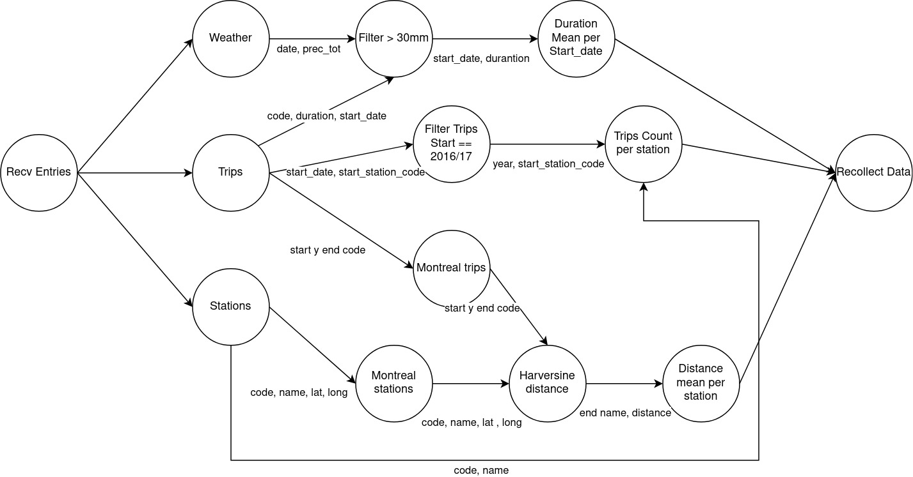
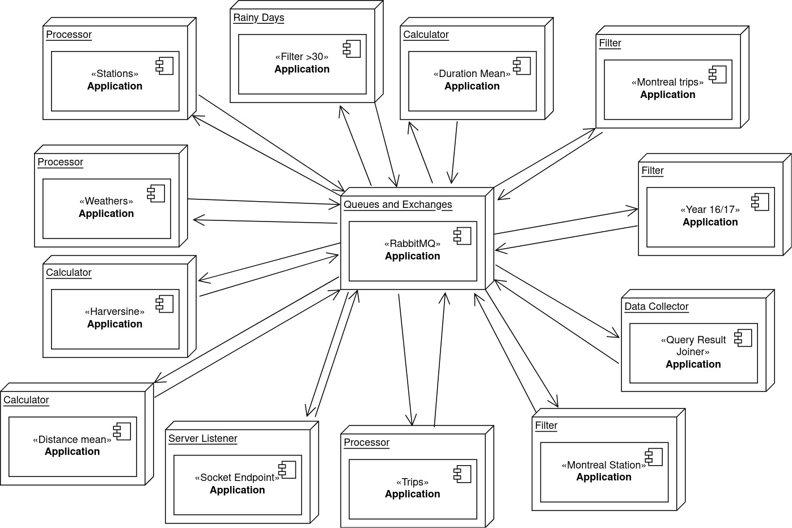
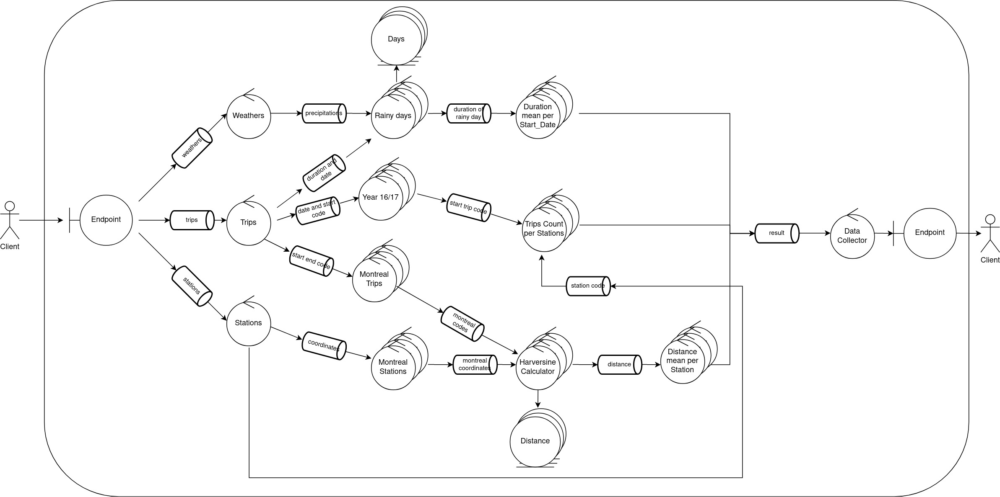
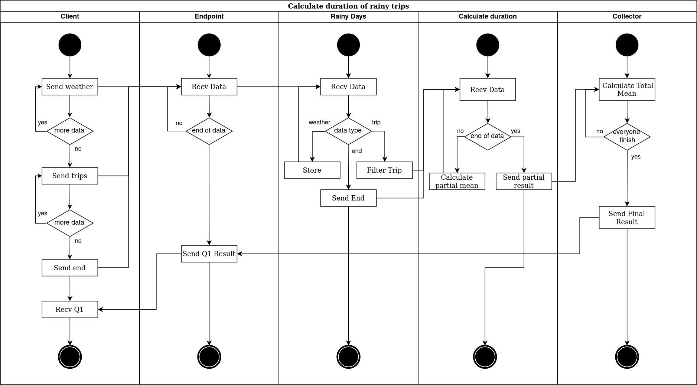
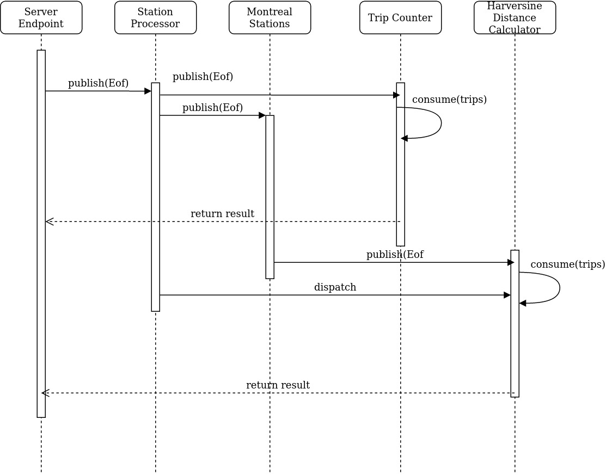

# INFORME SISTEMAS DISTRIBUIDOS
# TRABAJO PRÁCTICO N° 1

| **Nombre** | Mauricio Rodríguez Bertella |
| ---------- | :-------------------------: |
| **Padrón** |           100624            |
| **Mail**   |    mrodriguezb@fi.uba.ar    |

---

## Guía uso

Para correr el compose se usa el comando 

```sudo make docker-compose-up```

Para ver los logs el comando

```sudo make docker-compose-logs```

Para detener el programa

```sudo make docker-compose-down```

## Introducción
En el presente trabajo práctico se trabaja sobre un dataset de los registros de viajes
realizados con bicicletas de la red pública provista por grandes ciudades (washington, montreal y toronto).
Estos registros cuentan con información sobre los viajes, el clima y las estaciones correspondientes a estos viajes
. El trabajo lo que busca resolver son 3 queries que, dado el volumen del
dataset, se resuelve utilizando un sistema distribuidos.
La queries son las siguientes:

Q1 - La duración promedio de viajes que iniciaron en días con
precipitaciones >30mm.

Q2 - Los nombres de estaciones que al menos duplicaron la cantidad de
viajes iniciados en ellas entre 2016 y el 2017.

Q3 - Los nombres de estaciones de Montreal para la que el promedio de
los ciclistas recorren más de 6km en llegar a ellas.

## Lógica

En principio, el sistema toma las entradas recibidas desde el cliente y pasa
a procesarlas en un sistema de pipeline de tipo `worker per filter`.
Divide dependiendo de si pertenece a una entrada de tipo `station`, `weather` o `trip`, luego
cada una de estas va pasando por distintos filter realizando diferentes operaciones. Esto permite que el sistema comience su funcionamiento desde el instante cero sin tener que esperar a que se reciban, por ejemplo, primero todos los weathers. Además este tipo de separación de los workers por tipo de mensaje, permite en un futuro agregar otro tipo de mensaje y la reutilización de alguno de los workers ya existente sin tener que modificar mayormente la arquitectura a la hora de, por ejemplo, agregar otra query.
Al final de los filtros `duration_mean` , `distance_mean` y `trip_count` resulta la
información necesaria para dar el resultado de cada una de la queries. Esta información se recolecta
y se le devuelve al cliente en modo de respuesta.

*Diagrama DAG*

### Workerks

- **Weather processor**: toma los datos de tipo clima y los pasa a Rainy Days para que los filtre.
- **Rainy days**: recibe los datos del clima y los filtra dependiendo la cantidad de lluvia ese día (se queda con los > a 30mm). Una vez que termina de recibir todos los clima, comienza a recibir los trips y pasa a Duration Mean los trips de días lluviosos
- **Duration Mean**: calcula el promedio de duración de los viajes por cada día lluvioso.
- **Trips processor**: toma los datos de viajes, y los reenvia hacía Rainy Days, Year Filter, y Montreal Trips mandandole a cada uno de estos la data especifica que necesitan.
- **Year filter**: filtra los trips solo de 2016 y 2017 y los pasa a Trip count.
- **Trip count**:  al finalizar de recibir todos los nombres de stations, cuenta la cantidad de viajes por estaciones-año. Cuando termina de recibir todas los trips, filtra los que hayan duplicado cantidad de viajes de un año al otro.
- **Montreal trips**: filtra los viajes solo si son de montreal
- **Montreal stations**: filtra los stations solo si son de montreal.
- **Station processor**: envia las stations a Montreal Stations y a Trip count (solo la información que necesitan).
- **Harversine Distance**: calcula para cada viaje la distancia entre la estación de principio y final.
- **Distance mean**: guarda las distancias promedio recorridas hacia las estaciones, al finalizar filtra por un promedio mayor a 6Km.

## Protocolo de comunicación

Para protocolo de comunicación entre cliente y servidor se utiliza TLV (type, large, value),
con los tipos `TRIP`, `WEATHER`, `STATION` y `RESULT` dependiendo del mensaje.
La longitud del mensaje se expresa como un int de 4 bytes. Dado que la información se manda en batches de 8K
como tamaño máximo, el body del mensaje es cada uno de los mensajes separados por "`;`". Al leerse la base de datos
que se encuentra como archivo csv, cada una de las filas se envia como un mensaje, separando los valores por "`,`" y a su vez
cada fila por "`;`". El sistema está preparado para que el dataset se envie en desorden, por lo que
al finalizar de enviar cada uno de los tipos de datos `TRIP`, `WEATHER` Y `STATION`
se manda un mensaje de este mismo tipo pero con value `END` que representa el fin de este tipo de mensaje.

Por otro lado, dentro del sistema, los mensajes se envian entre filtros también batcheados, con el mismo formato de _VALUE_
pero sin utilizar TLV.

## Middleware RabbitMQ

Para la comunicación entre cada uno de los filtros los mensajes internos del sistema
se encolan utilizando `RabbitMQ`. Todos los filtros deben utilizar este middleware
si desean comunicarse con otro. Este mismo, encapsula todo el comportamiento que brinda la libreria
permitiendo a los filtros abstraerse de la comunicación.


*Diagrama de paquetes*

En general en casi todos los casos la comunicacipón se realiza mediante una `queue`
permitiendo varios filtros publicar en esta cola y varios otros subscribirse a esta misma, siguiente
un patrón de `Work Queue` con multiples publishers. En estas colas los mensajes se encolan de forma batcheada para 
agilizar la velocidad de transmisión de datos, disminuyendo así la cantidad de mensajes que hay en cada cola, por ende
también la cantidad de publish, consumes, y acks.

El único lugar donde no se utilizan el modelo `Work Queue` es desde el worker
`Server Endpoint` hacia los 3 workers `Processors` (uno de cada tipo).
En este caso se utiliza un `exchange` de tipo `direct` para que delege los mensajes
a la `queue` correspondiente, siguiente un patrón de `Publish/Subscriber`.

## Arquitectura
Se utiliza una arquitectura en forma de "estrella", optimizando el sistema para un entorno multicomputadoras, poniendo cada uno de los `workers`
en un container distinto.


*Diagrama de despliegue*

También el sistema permite replicación en varios de sus nodos, dejando así lugar
para repartir la carga de cada uno de estos si se quisiera escalar
su trabajo.


*Diagrama de robustez*

## Cliente
El cliente por su parte, solo se encarga de leer el dataset y enviarselo al endpoint del servidor con el protocolo previamente mencionado. Una vez envío toda la información, queda esperando la respuesta del servidor con los resultados.


*Diagrama de casos de uso*


## Fin de comunicación entre workers
Para cada una de las queries se genera un flujo de datos que se puede apreciar
por ejemplo para la Q1 en el siguiente diagrama.


*Diagrama de activadades*

Cada uno de los workers espera a tener la información necesaria para poder
realizar su trabajo y luego generar un resultado o aplican una operación a un
mensaje que reciben.

Para indicar el EOF de un flujo de información desde un conjunto `N` de workers `A` 
hacía otro conjunto `M` de workers `B` se realiza el siguiente método:
cada uno de los `N` workers `A` envia por la cola `M` mensajes de EOF. A la vez
cada uno de los `M` workers `B` esperan recibir `N` EOFs, una vez que reciben esa cantidad
se desconectan de la cola dando por finalizado ese flujo. De esta forma
puede que cuando un nodo `A` se desconecta, los `M` EOFs lo recibe un solo nodo `B`, 
o varios, o algunos. Pero lo que se cumple es que al final cuando todos los nodos `A`
se desconecten se habrán enviado `N` * `M` EOFs, y se habrán recibido `N` * `M` EOFs
del otro lado, finalizando así su conexión con esta queue todos los nodos `A` y `B`. 

Por ejemplo cuando finalizan de recibirse todas los mensajes de tipo stations, la cadena de EOFs se puede apreciar en el siguiente diagrama.


*Diagrama de secuancia: envio de eof (stations)*

Uno de los contras que tiene este sistema de comunicación de EOF es que puede ocurrir que algunos de los nodos `B` sigan funcionando mientras otros ya se desconectaron. Además, solo sirve para EOFs, si uno quisiera mandar un "TAG" o algo como "Guarda cache todo lo que hiciste hasta ahora pero seguí trabajando" no podrías hacerlo con este método.

La ventaja de este método es que de una manera muy sencilla se puede manejar el fin de comunicación de N a M workers.

## Performance
El sistema devuelve consistentemente el resultado de las queries en un tiempo de 23 minutos sin utilizar replicación. Y en un tiempo de unos 14 minutos utilizandola. Los mensajes de tipo weathers y stations, en este caso, con este dataset, se envian del cliente al servidor en menos de 3 segundos, no siendo así el caso de los trips.

En todo el desarrollo del tp, no se presentaron cuellos de botella en ninguna de las colas del programa. Ni siquiera utilizando el sistema sin réplicas.

## Conclusiones
Hacer el diseño de este sistema fue muy complejo, tomando en cuenta que la arquitectura tiene todo lo necesario como para hacerla de forma distribuida realmente y no solo correrla con docker compose. Además el hecho de que tenga que poder escalar la cantidad de datos que procesa y que se le pueda agregar en un futuro un stream continuo de datos, también le agrega una notoria cantidad de complejidad.

En cuanto a RabbitMQ, resultó una herramienta de trabajo muy potente, ya que permite abstraerse de los problemas de tipo recurso compartido, race conditions, almacenamiento y administración de los mensajes en las colas. El dashboard que otorga también brinda una herramienta fundamental para el debugueo. Usando rabbit la comunicación entre workers fue un problema menos.
